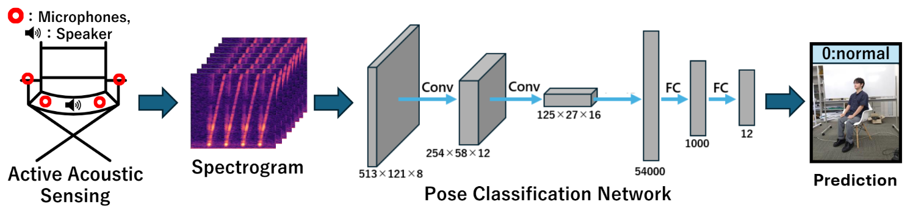

# Piezoelectric-Acoustic-Sensing-for-Sitting-Pose-Classification

We provide Pytorch implementation of the BMVC 2025 paper "Piezoelectric-Acoustic-Sensing-for-Sitting-Pose-Classification."

## Abstract
<p align="center">

</p>

 Recognizing human poses, particularly under seated conditions, has become increasingly important due to the widespread adoption of remote work and teleconferencing. In this study, we present the first attempt to classify sitting poses using active acoustic sensing based on contact-type piezoelectric devices attached to a chair. Our framework analyzes multi-channel acoustic responses of known sweep signals transmitted through the chair and the seated body and captured by a piezoelectric microphone array. To enhance classification performance, we introduce two learning techniques tailored to this setting. Specifically, we introduce ChannelSwap (CS), a data augmentation method that leverages the geometric symmetry of the sensing system, and Symmetric Consistency Enhancement (SCE), a learning strategy designed to compensate for real-world symmetry deviations. Experiments on real sound data demonstrate that our method improves classification accuracy by 3.6% compared to standard baselines, validating the feasibility and effectiveness of piezoelectric acoustic sensing for sitting pose classification.

## Setup

### 1. Environment
Please follow the steps below to build your environment.

```bash
# Create a conda environment 
conda create -n audio_pose python
conda activate audio_pose

# Install torch and torchvision
# Please refer to https://pytorch.org/ if you need a different cuda version
conda install pytorch torchvision pytorch-cuda=12.1 -c pytorch -c nvidia

# Clone this repo
git clone https://github.com/yuki10647/Piezoelectric-Acoustic-Sensing-for-Sitting-Pose-Classification.git
cd Piezoelectric-Acoustic-Sensing-for-Sitting-Pose-Classification

# Install dependencies
pip install -r requirements.txt

# Finished
```

### 2. Data Preparation
#### Sitting_Pose_Classification
The dataset will be downloaded when the code is run.
We prepare our own dataset. 
The download page of kaggle is [here](https://www.kaggle.com/datasets/yuki5515/sitting-pose-classification)

- The directory structure should look like
```
Piezoelectric-Acoustic-Sensing-for-Sitting-Pose-Classification/
|-- Cross_Sub
|   |-- csv/
|   |-- data/
|
|-- Single_Sub
|   |-- csv/
|   |-- data/
```

### 3. Run
We prepare Cross Validation code to run.
``` bash
# Single-Subject
python CV_Single.py

# Cross-Subject
python CV_Cross.py
```

## Citation
```
@article{Shibuya2025audio_pose,
  title={Piezoelectric-Acoustic-Sensing-for-Sitting-Pose-Classification},
  author={Shibuya, Yuuki and Irie, Go},
  journal={The British Machine Vision Conference},
  year={2025}
}
```
